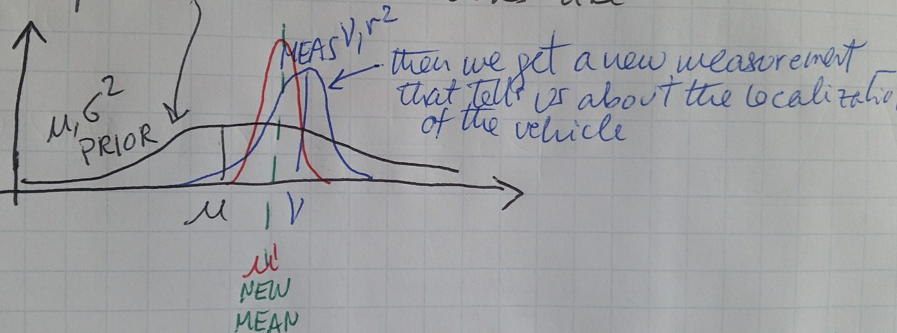
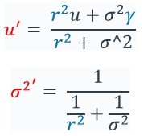
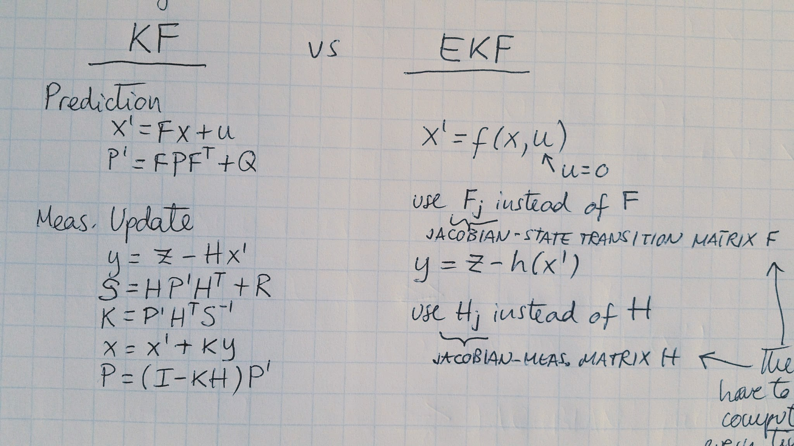
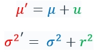
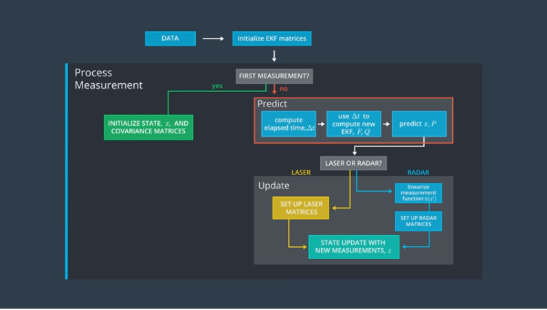
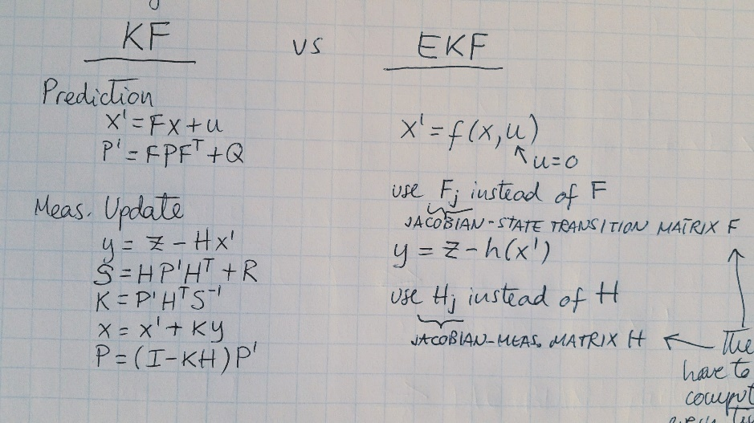
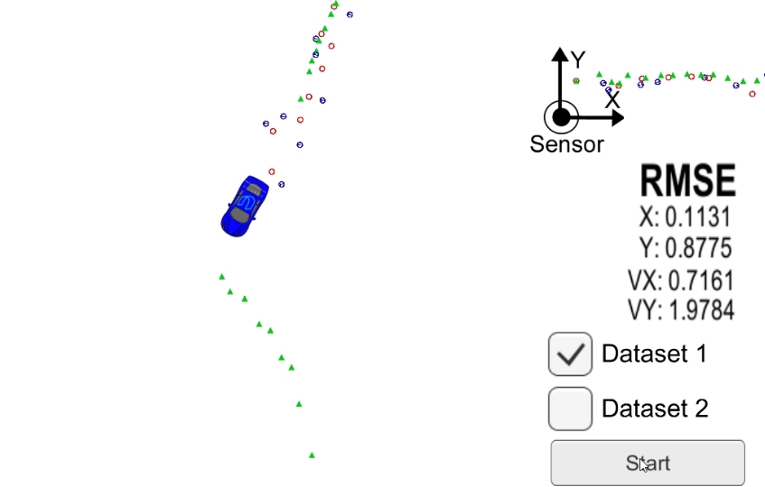
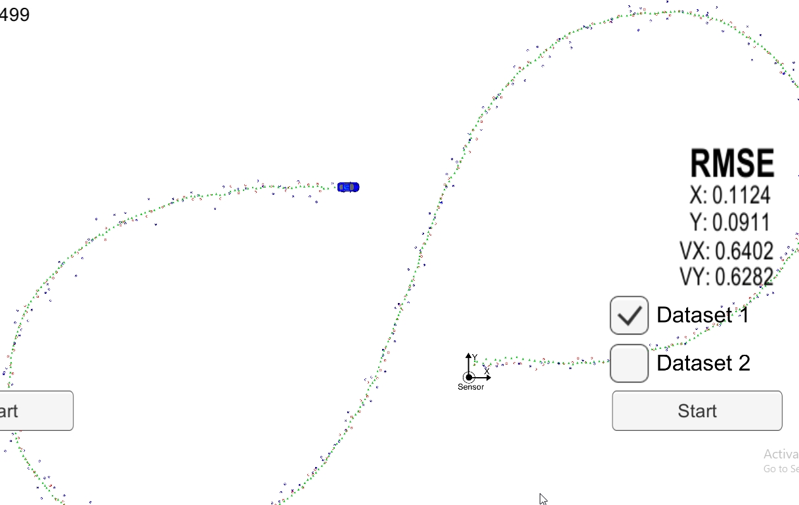
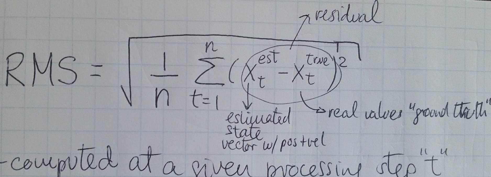

**Self-Driving Car Engineer Nanodegree**

**Term2 – Project1: Extended Kalman Filter**

**INTRODUCTION**

The purpose of the project is to estimate the location of a moving
vehicle using 2 given measurements: LIDAR and RADAR. These 2
measurements can be read at any point in time. The estimate will be
computed using a Kalman Filter (KF) and an Extended Kalman Filter (EKF).

**BASIC KF FILTERS IN 1D**

1.  KF can be used to “fuse” 2 measurements using the measurement values
    and uncertainties (on this case the covariance of the standard
    distribution):

On the above case, the existing measurement in **BLACK**, is “fused”
with the new measurement in **BLUE**, to create a new measurement mean
and distribution in **RED**. The formulas used are:

$$u^{'} = \ \frac{r^{2}u + \sigma^{2}\gamma}{r^{2} + \ \sigma\hat{}2}$$

$${\sigma^{2}}^{'} = \ \frac{1}{\frac{1}{r^{2}} + \frac{1}{\sigma^{2}}}$$

1.  KF can also be used to predict the new location of an object based
    on it’s current speed:

The current estimate is shown in **BLUE**, the speed estimate(converted
to traveled distance) is shown in **GREEN**, and the new estimated
location is shown in **RED**. The formulas are:

$$\mu^{'} = \mu + u$$

$${\sigma^{2}}^{'} = \ \sigma^{2} + r^{2}$$

**KF IN 2D**

KF can be extended to a 2D space (formulas are in document
sensor-fusion-ekf-reference.pdf), in which the state vector is defined
as position Px, Py and velocities Vx, Vy. The prediction and update step
formulas are shown below:

**WHY EXTENDED KF?**

Since in 2D the predicted state consists of 4 variables: Px, Py, Vx, Vy,
it needs to be converted in to the same variables that we will be
getting from the RADAR measurements: rho, psi, and rhodot. The
measurement H matrix multiplies the predicted state to convert it to
polar coordinates.

Also, the predicted state that is described by a Gaussian distribution
will become non-linear after transformed by the measurement H matrix. To
linearize the system, the tangent of the NL system at the mean is
calculated to linearize it. To accomplish this, partials are used
(Jacobian Matrix).

The EKF is compared below to the formulas of the KF:

{width="4.048611111111111in"
height="2.0743438320209973in"}

**CODE FLOWCHART**

The project code follows the flowchart shown in UDACITY’s website:

{width="4.597222222222222in"
height="2.8819444444444446in"}

The above flowchart is put into C++ code by using 4 main files:

-main.cpp: is the main program and uses uWebSocketIO library to
communicate with the simulator to receive measurements and send location
estimates to be displayed real-time.

-FusionEKF.cpp: initializes the filter, calls predict, and calls update.

-kalman\_filter.cpp: defines functions: predict, update, and
updateEKF(“extended” for RADAR measurements).

-tools.cpp: defines functions for RMSE and Jacobian.

**INSTRUMENTATION COVARIANCE MATRICES**

Both RADAR and LASER covariance values are given. They are not
cross-correlated (i.e. the values form a diagonal matrix):

R\_laser\_ &lt;&lt; 0.0225, 0.0000,

0.0000, 0.0225;

R\_radar\_ &lt;&lt; 0.0900, 0.0000, 0.0000,

0.0000, 0.0009, 0.0000,

0.0000, 0.0000, 0.0900;

**MEASUREMENT AND TRANSITION MATRIX**

Defined in Fusion.EKF:

//measurement matrix

H\_laser\_ &lt;&lt; 1, 0, 0, 0,

0, 1, 0, 0;

//the initial transition matrix F\_

ekf\_.F\_ &lt;&lt; 1, 0, 1, 0,

0, 1, 0, 1,

0, 0, 1, 0,

0, 0, 0, 1;

**INITIALIZATION OF STATE X AND MATRICES**

The first measurement is defined in Fusion.EKF as:

ekf\_.x\_ &lt;&lt; 1, 1, 1, 1;

State matrix is initialized in Fusion.EKF:

//state covariance matrix P

ekf\_.P\_ &lt;&lt; 1, 0, 0, 0,

0, 1, 0, 0,

0, 0, 1000, 0,

0, 0, 0, 1000;

**PREDICT STEP**

**x\_ = F\_ \* x\_;**

**P\_ = F\_ \* P\_ \* F\_.transpose() + Q\_;**

**UPDATE STEP**

Regular Kalman Filter (to be used with LIDAR):

**VectorXd y = z - H\_ \* x\_;**

**MatrixXd S = H\_ \* P\_ \* H\_.transpose() + R\_;**

**MatrixXd K = P\_ \* H\_.transpose() \* S.inverse();**

**x\_ = x\_ + (K \* y);**

**MatrixXd I = MatrixXd::Identity(x\_.size(),x\_.size());**

**P\_ = (I - K \* H\_) \* P\_;**

But if using RADAR, an EKF is needed:

float rho = sqrt(x\_\[0\]\*x\_\[0\] + x\_\[1\]\*x\_\[1\]);

float phi = atan2(x\_\[1\], x\_\[0\]);

float rhodot;

z\_pred &lt;&lt; rho, phi, rhodot;

VectorXd y = z - z\_pred;

MatrixXd S = H\_ \* P\_ \* H\_.transpose() + R\_;

MatrixXd K = P\_ \* H\_.transpose() \* S.inverse();

x\_ = x\_ + (K \* y);

MatrixXd I = MatrixXd::Identity(x\_.size(),x\_.size());

P\_ = (I - K \* H\_) \* P\_;

**NUMERICAL CONSIDERATIONS**

The kalman\_filter.cpp file contains the Extended KF routine. It
converts the current state to polar coordinates so that they can be
“fusioned” with the new RADAR (polar) measurements. Two quantities had
to be checked to ensure numerical accuracy of the code:

1.  rhodot is defined as: (x\_\[0\] \* x\_\[2\] + x\_\[1\] \* x\_\[3\])
    / rho . If rho is a value close to zero, then rhodot would go
    to infinity. Therefore if rho is within a value very close to 0,
    rhodot is set to 0.0

2.  Quantity y\[1\] compares the current estimate x with the new
    measurement z by calculating an error: y = z – H.x . This difference
    was creating errors close to the 90degree vertical line(see below
    image):

    

    Since y\[1\] is the difference of 2 angles, it is necessary to
    “normalize” the difference to ensure that the range of y stays
    within the boundaries of –pi and +pi.

    

    There are 2 ways of doing this:

    a.  IF loop: if y\[1\] &lt; -pi , then add +2pi . If y\[1\] &gt; pi,
        then substract 2 pi. The problem with this method is that it
        introduces a discontinuity in the calculations.

    b.  A much better approach is to use Trigonometry to ensure the y
        value stays within bounds. The arc tangent of sin(angle) divided
        by cos(angle). This is accomplished by coding: y\[1\]
        = atan2(sin(y\[1\]) / cos(y\[1\]))

**ACCURACY OF COMPUTATIONS**

The accuracy of the KF computations is calculated using a Root Mean
Squared (RMS) formula with respect to the ground truth of the moving
vehicle:

The RMSE values for the Dataset 1 are shown below:

The RMSE values for the Dataset 1 are shown below:

